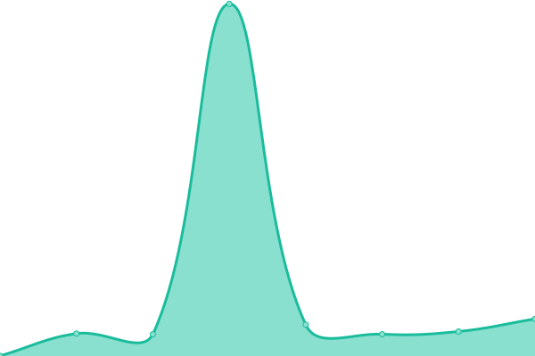

# [📈 Live Status](https://inwage.github.io/status_page): <!--live status--> **🟧 Partial outage**

This repository contains the open-source uptime monitor and status page for [Inwage](https://www.inwage.com), powered by [Upptime](https://github.com/upptime/upptime).

With [Upptime](https://upptime.js.org), you can get your own unlimited and free uptime monitor and status page, powered entirely by a GitHub repository. We use [Issues](https://github.com/inwage/status_page/issues) as incident reports, [Actions](https://github.com/inwage/status_page/actions) as uptime monitors, and [Pages](https://inwage.github.io/status_page) for the status page.

<!--start: status pages-->
<!-- This summary is generated by Upptime (https://github.com/upptime/upptime) -->
<!-- Do not edit this manually, your changes will be overwritten -->
<!-- prettier-ignore -->
| URL | Status | History | Response Time | Uptime |
| --- | ------ | ------- | ------------- | ------ |
|  [Bitwage Homepage](https://www.bitwage.com) | 🟩 Up | [bitwage-homepage.yml](https://github.com/inwage/status_page/commits/HEAD/history/bitwage-homepage.yml) | 

 989ms
     
 | 

<a href="https://status.bitwage.com/history/bitwage-homepage">100.00%</a>
    

|  [Bitwage Support](https://support.bitwage.com) | 🟩 Up | [bitwage-support.yml](https://github.com/inwage/status_page/commits/HEAD/history/bitwage-support.yml) | 

 259ms
     
 | 

<a href="https://status.bitwage.com/history/bitwage-support">100.00%</a>
    

|  [Bitwage Blog](https://blog.bitwage.com) | 🟩 Up | [bitwage-blog.yml](https://github.com/inwage/status_page/commits/HEAD/history/bitwage-blog.yml) | 

 154ms
     
 | 

<a href="https://status.bitwage.com/history/bitwage-blog">100.00%</a>
    

|  [Bitwage API](https://api2.bitwage.com) | 🟩 Up | [bitwage-api.yml](https://github.com/inwage/status_page/commits/HEAD/history/bitwage-api.yml) | 

 146ms
     
 | 

<a href="https://status.bitwage.com/history/bitwage-api">100.00%</a>
    

|  [Bitwage API (Sandbox)](https://api.sandbox.bitwage.com) | 🟥 Down | [bitwage-api-sandbox.yml](https://github.com/inwage/status_page/commits/HEAD/history/bitwage-api-sandbox.yml) | 

 216ms
     
 | 

<a href="https://status.bitwage.com/history/bitwage-api-sandbox">65.58%</a>
    

|  [Bitwage API Docs](https://developer.bitwage.com) | 🟩 Up | [bitwage-api-docs.yml](https://github.com/inwage/status_page/commits/HEAD/history/bitwage-api-docs.yml) | 

 977ms
     
 | 

<a href="https://status.bitwage.com/history/bitwage-api-docs">100.00%</a>
    

<!--end: status pages-->

[**Visit our status website →**](https://inwage.github.io/status_page)

## 📄 License

- Powered by: [Upptime](https://github.com/upptime/upptime)
- Code: [MIT](./LICENSE) © [Inwage](https://www.inwage.com)
- Data in the `./history` directory: [Open Database License](https://opendatacommons.org/licenses/odbl/1-0/)
