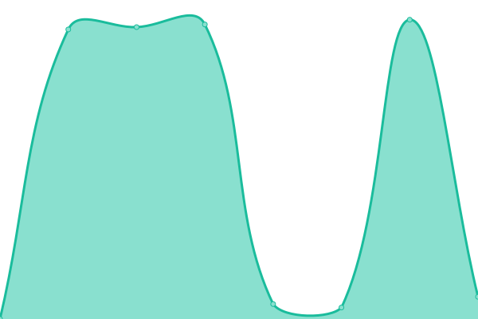
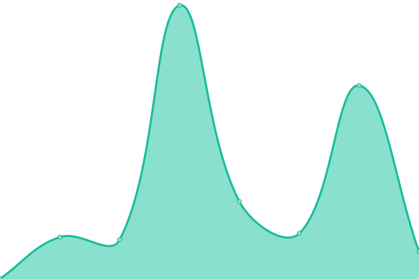
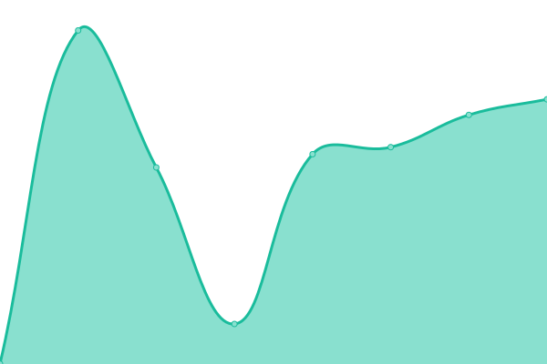

# [📈 Live Status](https://inwage.github.io/status_page): <!--live status--> **🟩 All systems operational**

This repository contains the open-source uptime monitor and status page for [Inwage](https://www.inwage.com), powered by [Upptime](https://github.com/upptime/upptime).

With [Upptime](https://upptime.js.org), you can get your own unlimited and free uptime monitor and status page, powered entirely by a GitHub repository. We use [Issues](https://github.com/inwage/status_page/issues) as incident reports, [Actions](https://github.com/inwage/status_page/actions) as uptime monitors, and [Pages](https://inwage.github.io/status_page) for the status page.

<!--start: status pages-->
<!-- This summary is generated by Upptime (https://github.com/upptime/upptime) -->
<!-- Do not edit this manually, your changes will be overwritten -->
<!-- prettier-ignore -->
| URL | Status | History | Response Time | Uptime |
| --- | ------ | ------- | ------------- | ------ |
|  [bitwage support](https://support.bitwage.com) | 🟩 Up | [bitwage-support.yml](https://github.com/inwage/status_page/commits/HEAD/history/bitwage-support.yml) | 

 405ms
     
 | 

<a href="https://status.bitwage.com/history/bitwage-support">100.00%</a>
    

|  [bitwage blog](https://blog.bitwage.com) | 🟩 Up | [bitwage-blog.yml](https://github.com/inwage/status_page/commits/HEAD/history/bitwage-blog.yml) | 

 474ms
     
 | 

<a href="https://status.bitwage.com/history/bitwage-blog">100.00%</a>
    

|  [bitwage home page](https://www.bitwage.com) | 🟩 Up | [bitwage-home-page.yml](https://github.com/inwage/status_page/commits/HEAD/history/bitwage-home-page.yml) | 

 415ms
     
 | 

<a href="https://status.bitwage.com/history/bitwage-home-page">100.00%</a>
    

|  pay api production | 🟩 Up | [pay-api-production.yml](https://github.com/inwage/status_page/commits/HEAD/history/pay-api-production.yml) | 

 875ms
     
 | 

<a href="https://status.bitwage.com/history/pay-api-production">100.00%</a>
    

|  pay api sandbox | 🟩 Up | [pay-api-sandbox.yml](https://github.com/inwage/status_page/commits/HEAD/history/pay-api-sandbox.yml) | 

 859ms
     
 | 

<a href="https://status.bitwage.com/history/pay-api-sandbox">100.00%</a>
    

|  pay api documentation | 🟩 Up | [pay-api-documentation.yml](https://github.com/inwage/status_page/commits/HEAD/history/pay-api-documentation.yml) | 

 664ms
     
 | 

<a href="https://status.bitwage.com/history/pay-api-documentation">100.00%</a>
    

|  proxy api production | 🟩 Up | [proxy-api-production.yml](https://github.com/inwage/status_page/commits/HEAD/history/proxy-api-production.yml) | 

 1225ms
     
 | 

<a href="https://status.bitwage.com/history/proxy-api-production">100.00%</a>
    

|  proxy api sandbox | 🟩 Up | [proxy-api-sandbox.yml](https://github.com/inwage/status_page/commits/HEAD/history/proxy-api-sandbox.yml) | 

 5203ms
     
 | 

<a href="https://status.bitwage.com/history/proxy-api-sandbox">100.00%</a>
    

|  proxy api documentation | 🟩 Up | [proxy-api-documentation.yml](https://github.com/inwage/status_page/commits/HEAD/history/proxy-api-documentation.yml) | 

 785ms
     
 | 

<a href="https://status.bitwage.com/history/proxy-api-documentation">100.00%</a>
    

|  [bitwage api sandbox](https://api.sandbox.bitwage.com) | 🟩 Up | [bitwage-api-sandbox.yml](https://github.com/inwage/status_page/commits/HEAD/history/bitwage-api-sandbox.yml) | 

 238ms
     
 | 

<a href="https://status.bitwage.com/history/bitwage-api-sandbox">100.00%</a>
    

|  [bitwage api production](https://api2.bitwage.com) | 🟩 Up | [bitwage-api-production.yml](https://github.com/inwage/status_page/commits/HEAD/history/bitwage-api-production.yml) | 

 258ms
     
 | 

<a href="https://status.bitwage.com/history/bitwage-api-production">100.00%</a>
    

|  private bitwage api documentation | 🟩 Up | [private-bitwage-api-documentation.yml](https://github.com/inwage/status_page/commits/HEAD/history/private-bitwage-api-documentation.yml) | 

 2461ms
     
 | 

<a href="https://status.bitwage.com/history/private-bitwage-api-documentation">100.00%</a>
    

|  [public bitwage api documentation](https://docs1.bitwage.com) | 🟩 Up | [public-bitwage-api-documentation.yml](https://github.com/inwage/status_page/commits/HEAD/history/public-bitwage-api-documentation.yml) | 

 578ms
     
 | 

<a href="https://status.bitwage.com/history/public-bitwage-api-documentation">100.00%</a>
    

|  [user portal frontend sandbox](https://app.sandbox.bitwage.com) | 🟩 Up | [user-portal-frontend-sandbox.yml](https://github.com/inwage/status_page/commits/HEAD/history/user-portal-frontend-sandbox.yml) | 

 1551ms
     
 | 

<a href="https://status.bitwage.com/history/user-portal-frontend-sandbox">100.00%</a>
    

|  [user portal frontend production](https://app.bitwage.com) | 🟩 Up | [user-portal-frontend-production.yml](https://github.com/inwage/status_page/commits/HEAD/history/user-portal-frontend-production.yml) | 

 391ms
     
 | 

<a href="https://status.bitwage.com/history/user-portal-frontend-production">100.00%</a>
    

|  admin portal frontend sandbox | 🟩 Up | [admin-portal-frontend-sandbox.yml](https://github.com/inwage/status_page/commits/HEAD/history/admin-portal-frontend-sandbox.yml) | 

 885ms
     
 | 

<a href="https://status.bitwage.com/history/admin-portal-frontend-sandbox">100.00%</a>
    

|  admin portal frontend production | 🟩 Up | [admin-portal-frontend-production.yml](https://github.com/inwage/status_page/commits/HEAD/history/admin-portal-frontend-production.yml) | 

 311ms
     
 | 

<a href="https://status.bitwage.com/history/admin-portal-frontend-production">100.00%</a>
    

<!--end: status pages-->

[**Visit our status website →**](https://inwage.github.io/status_page)

## 📄 License

- Powered by: [Upptime](https://github.com/upptime/upptime)
- Code: [MIT](./LICENSE) © [Inwage](https://www.inwage.com)
- Data in the `./history` directory: [Open Database License](https://opendatacommons.org/licenses/odbl/1-0/)
